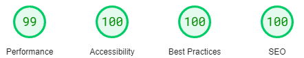
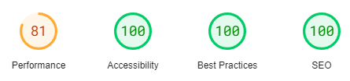
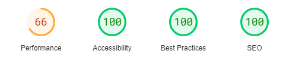
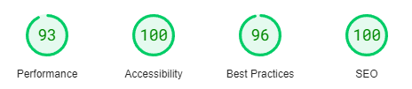

# Testing Page Table of Contents
* [**During Development Testing**](#during-development-testing)
    * [*Manual Testing*](#manual-testing)
    * [*Bugs and Fixes*](#bugs-and-fixes)
* [**Post Development Testing**](#post-development-testing)
  * [**Validators**](#validators)
      * [*HTML*](#html---httpsvalidatorw3orgnu)
      * [*CSS*](#css---httpsjigsaww3orgcss-validator)
  * [**Lighthouse Scores**](#lighthouse-scores)
      * [*Desktop Version:*](#desktop-version)
      * [*Mobile Version*](#mobile-version)
      * [*Lighthouse Score Feedback From Third Party Testers*](#lighthouse-score-feedback-from-third-party-testers)
  * [**Accessability**](#accessability)

## **During Development Testing**
During the development process, I was manually testing in the following ways:-

1. Manually testing each element for appearance and responsiveness via a simulated live server using an extension in VSCode.
    
1. Published the page via GitHub pages and made sure everything was working well on the officially published page.

### ***Manual Testing:***
* During testing, I used four different browsers to ensure cross-compatibility. The desktop browsers used by myself were:

  1. Chrome
  2. Firefox
  3. Edge

* I then used the devtools to simulate different screen sizes/devices from 320 px up to 4000px in width. 
* I also tested them on the devices i own like an iPhone and an iPad.
* I provided some friends and family with the link to my webpage for testing to see if they came across any issues.

### ***Bugs and Fixes:***

Below is a list of bugs I found during the development process by testing myself via the website i ported on gitpod. I tried each element for how the browser would display the page to potential users on a range of different screen widths from 320px to 4000px:-

1. **Intended Outcome** - Text fitting the different screen sizes.
    * ***Issue Found:*** 
        * Using "font-size" on CSS i had to repeat it multiple times.
    * ***Solution Used:*** 
        * Used "height: fit-content;" to make it fit the div.
1. **Intended Outcome** - The footer elements to be evenly spaced.
    * ***Issue Found:*** 
        * Initially using margin and padding to move the different elements around the page it was coming out of line on different screen sizes.
    * ***Solution Used:***    
        * I resolved this by using CSS flex and using "justify-content: space-evenly;"
1. **Intended Outcome** - I class icons not showing.
    * ***Issue Found:*** 
        * The icons would not appear on the website.
    * ***Solution Used***:
        * I forgot to add the font awesome kit to the code, once i done that they were appearing.
1. **Intended Outcome** - A hero image to span the entire width of the page and be fully responsive across all screen sizes.
    * ***Issue Found:*** 
        * Some images were repeating themselves.
    * ***Solution Used:*** 
        * I added "background-size: cover;" to my CSS so it fit the screen.
1. **Intended Outcome** - A thin navbar at the top of the page.
    * ***Issue Found:*** 
        * I struggled to make the navbar not as thick.
    * ***Solution Used:***
        * I went back to the loverunning project videos and seen i missed out a few lines of code like "top: 100%; , padding: 0 1rem;"
1. **Intended Outcome** - When screen sizes exceed certain widths the personal trainer and classes section scale to the screen.
    * ***Issue Found:***
        * Certain parts of the div would go off the screen.
    * ***Solution Used:***
        * I used CSS Flex to make them fit on the screen evenly.
1. **Intended Outcome** - Sign-up page to display on the whole screen.
    * ***Issue Found:***
        * Big white part at the bottom of the screen.
    * ***Solution Used:***
        * Added CSS code for it to fit the screen "min-height: 100vh;"
1. **Intended Outcome** - All text to be easily readable.
    * ***Issue Found:***
        * Sometimes the white text wouldnt stand out enough to read it easily with the hero image.
    * ***Solution Used:***
        * Used CSS to add a background to the text so it stood out more.
1. **Intended Outcome** - All the background to be the same colour.
    * ***Issue Found:***
        * Had a faint white line between divs.
    * ***Solution Used:***
        * Wrapped all the divs on the home page in the <main> element and added a "main" selector in CSS with "background-color: #e0e1dd;"
1. **Intended Outcome** - All the headers to have the same elements.
    * ***Issue Found:***
        * I was using h1,h2,h3 which was working but looked messy.
    * ***Solution Used:***
        * Made a class called "header" and applied this class to my headers.

## **Post Development Testing**
### **Validators**

#### ***HTML*** - https://validator.w3.org/nu/
* ***Issue Found:***
    * I used a "ID" for 2 different paragraphs.
* ***Solution Used:***
    * I changed the ID to a Class Selector.
* ***Issue Found:***
    * I had a /div that was unneeded.
* ***Solution Used:***
    * I removed the unneeded /div
* ***Issue Found:***
    * I had a favicon file with a space in and i forgot to fix it in the codes href.
* ***Solution Used:***
    * I corrected the file name in the code.

I inputed all code into the Validator individually and all came back with no errors.

* All pages tested, no issues found via URL or file upload.\

### **Lighthouse Scores**
### **Test conditions**
* I did all lighthouse tests on every page on the website.
* I ran the tests for both mobile and desktop.
#### ***Desktop Version:***
I have only included one screenshot for desktop as all pages were the same score, only changing by one or two points in performance if I ran it multiple times. 

#### ***Mobile Version:***

* Due to the more significant variance in the performance score, I have included a screenshot for each mobile page.

1. ***index.html:***

     

2. ***gallery.html:***

    
* The performance score on this was orginally 49 but i changed all image files to .webp and i compressed all my file sizes of images to raise it to 66. If i tried to compress them more i began to lose quality on the images.

3. ***signup.html:***

    
***
[Return to README.md](README.md)